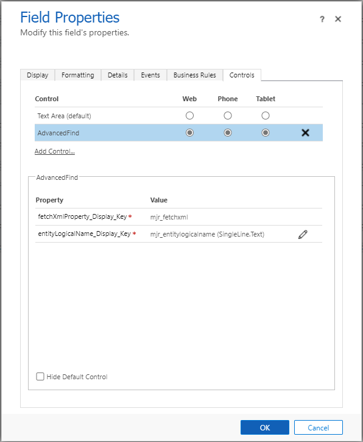

## Overview

This control lets you build FetchXml by using OOB Advanced Find control as part of Entity Form.

It requires 2 input;

- Bound Property, requires Multiline of Text field for storing FetchXml
- Input Property, entity logical name needed for Advanced Find query builder

## Configuration

## Disclaimer!

This control uses undocumented methods.
